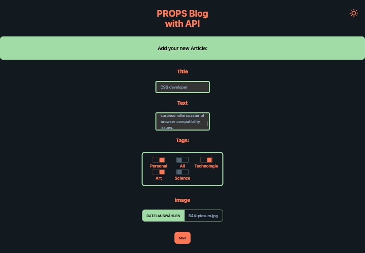

# Blog with Api & Server

# React + Vite + Tailwind + Daisyui (responsive)

# [Server & Api are here](https://github.com/MariaRiosNavarro/blog_backend)

All CRUD basic operations of persistent storage works with the Server.

Comming soon only 'PATCH', (Favorites Update, maybe the update of the badgets & update of images)

# Light & Dark

<div>


</div>

# Add

<div>




</div>

# Edit & Delete

<div>


</div>

# Install:

npm create vite@latest your-project-name -- --template react

cd your-project-name

npm i

npm install react-router-dom

npm i uuid

# Tailwind + Daisyui

npm install -D tailwindcss postcss autoprefixer

npx tailwindcss init -p

npm i -D daisyui@latest

- IN tailwind.config.js:

```javascript
/** @type {import('tailwindcss').Config} */
export default {
  content: ["./index.html", "./src/**/*.{js,ts,jsx,tsx}"],
  daisyui: {
    themes: ["lemonade", "sunset", "autumn"],
  },
  theme: {
    extend: {},
  },
  plugins: [require("daisyui")],
};
```

- IN daisyui, themes, choose the themes you want, here as example I use "lemonade", "sunset" and "autumn" (first ist for light mode default, second is for dark mode default)

* IN index.css

```css
@tailwind base;
@tailwind components;
@tailwind utilities;
```

# Repo

git init

git add .

git commit -m "first commit"

<!-- BG Photo <a href="https://unsplash.com/de/@gulfergin_01?utm_content=creditCopyText&utm_medium=referral&utm_source=unsplash">Gülfer ERGİN</a> auf <a href="https://unsplash.com/de/fotos/weisses-und-braunes-buch-auf-braun-gewebter-oberflache-LUGuCtvlk1Q?utm_content=creditCopyText&utm_medium=referral&utm_source=unsplash">Unsplash</a> -->
<!--
BG Photo <a href="https://unsplash.com/de/@chrisleeiam?utm_content=creditCopyText&utm_medium=referral&utm_source=unsplash">Chris Lee</a> auf <a href="https://unsplash.com/de/fotos/grune-blatter-70l1tDAI6rM?utm_content=creditCopyText&utm_medium=referral&utm_source=unsplash">Unsplash</a> -->

<!-- BG Photo <a href="https://unsplash.com/de/@ryunosuke_kikuno?utm_content=creditCopyText&utm_medium=referral&utm_source=unsplash">Ryunosuke Kikuno</a> auf <a href="https://unsplash.com/de/fotos/weiss-und-schwarz-kariertes-textil-RKwivgSTXVI?utm_content=creditCopyText&utm_medium=referral&utm_source=unsplash">Unsplash</a> -->

<!-- BG Photo <a href="https://unsplash.com/de/@sarahdorweiler?utm_content=creditCopyText&utm_medium=referral&utm_source=unsplash">Sarah Dorweiler</a> auf <a href="https://unsplash.com/de/fotos/grunblattrige-pflanze-auf-klarer-glasvase-gefullt-mit-wasser-x2Tmfd1-SgA?utm_content=creditCopyText&utm_medium=referral&utm_source=unsplash">Unsplash</a> -->

# IMAGES

Blog Articles from [picsum](https://picsum.photos/)

And as App Background:

BG Foto <a href="https://unsplash.com/de/@eugene_golovesov?utm_content=creditCopyText&utm_medium=referral&utm_source=unsplash">Eugene Golovesov</a> auf <a href="https://unsplash.com/de/fotos/grune-blatter-auf-weissem-hintergrund--_VkKpSNpuk?utm_content=creditCopyText&utm_medium=referral&utm_source=unsplash">Unsplash</a>

BG darkMode Foto <a href="https://unsplash.com/de/@iambobnelson?utm_content=creditCopyText&utm_medium=referral&utm_source=unsplash">Robert Nelson</a> auf <a href="https://unsplash.com/de/fotos/low-light-foto-von-wassertropfen-auf-dem-blatt-_7ijJz9nZmY?utm_content=creditCopyText&utm_medium=referral&utm_source=unsplash">Unsplash</a>
